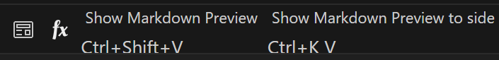

# 一级标签（#空格）
## 二
正文在这
111（这里没打空格就换行所以实际预览是没换行的

正文在这  
222（这里打完正文在这之后，点两次space,达到换行的效果）

### 三
这几天学的vscode快捷键  
比较常用：  
Ctrl + \ 拆分为多个编辑器  
Ctrl + 1、2 聚焦到第 1、第 2 个编辑器  
Ctrl + J 显示/隐藏控制台
Ctrl + · 终端
  //ctrl+k+v
Ctrl + Pagedown/Pageup 在已经打开的多个文件之间进行切换 （非常实用！！！）  
Ctrl + G 跳转到指定行  
w表示删除，n表示新建(ctrl+k,ctrl+w删编辑器)

Ctrl + 左右方向键 在单词之间移动光标  
Fn + 左右方向键（或 Win + 左右方向键） 将光标定位到当前行的最左侧、最右侧（在整行之间移动光标  
Alt + Shift + 左右方向键 左右扩大/缩小选中的范围
Alt + ↑ 将代码向上移动  
Alt + Shift + ↑ 将代码向上复制一行（由于vsc中，光标在那一行就是选择那一行的内容，所以直接c+v就可以复制这一行的代码到下一行了）

Ctrl + backspace/delete 删除光标前/后的单词！

### 四
1、**引用**  
> march030303  
> > 333  
>
2、**列表**  
i.无序列表  
+ 2
- 3  
* 4  

ii.有序列表  
iii.todolist  
- [ ] 3
- [ ] 4
- [ ]  4 

3、**表格**   
| 左对齐 | 居中对齐 | 右对齐 |  
|:---|:--:|---:|
|苹果|桃子|香蕉|  
|10元|20元|30元|  
 表示换行
4、**段落**  
--- 
这是横线
---  
*********  

333  

## 引用  
~~~代码块